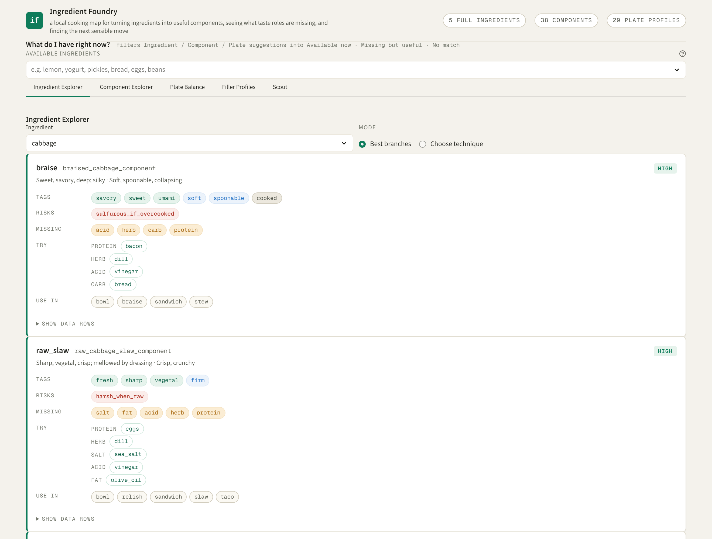
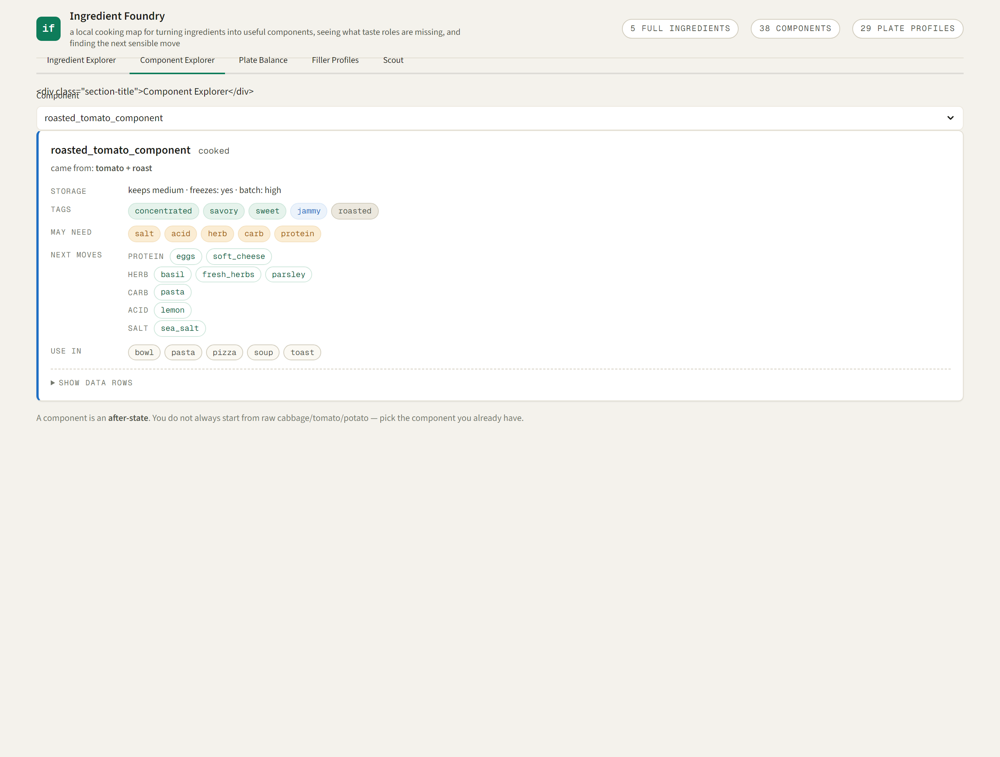
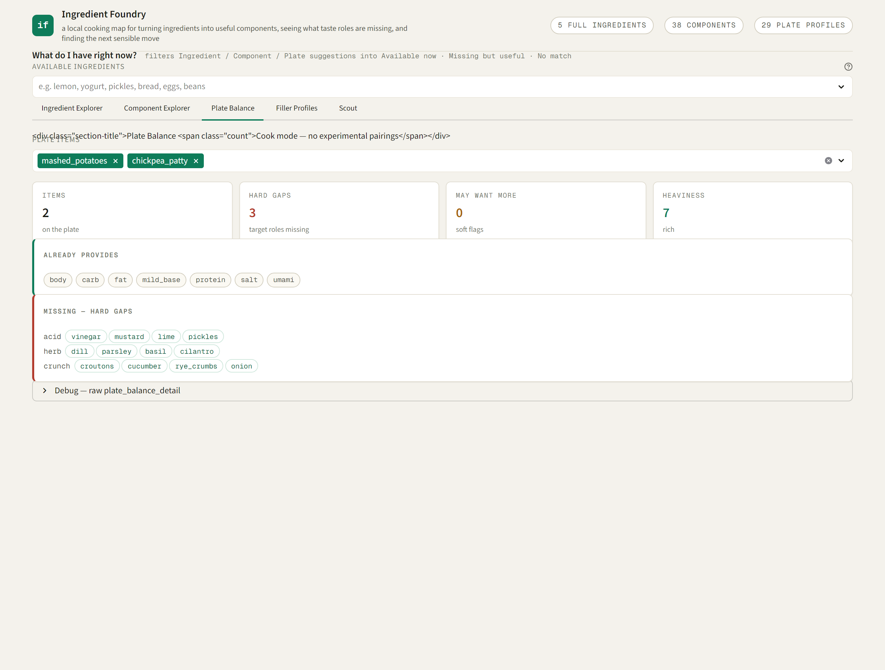
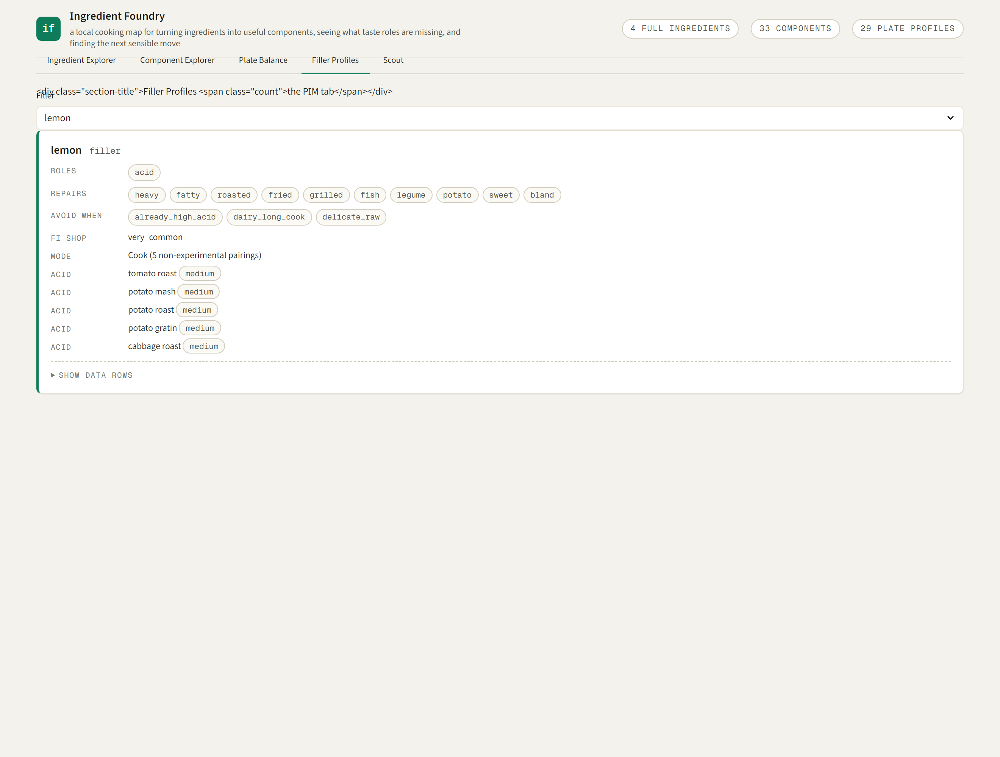
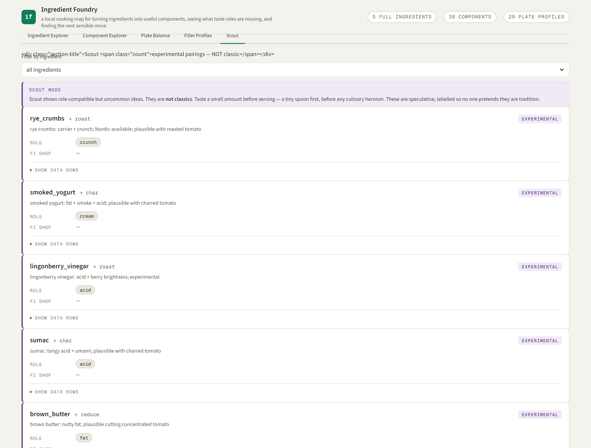
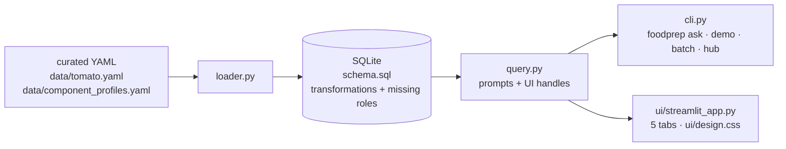

# food-prep

A local-first **ingredient transformation knowledge map**. Pilot ingredient: **tomato**.

## Why this is not a recipe app

This does not generate recipes. It asks:

- What can this ingredient become?
- What does that component still need?
- What fixes this plate?
- What plausible weird pairing is worth tasting carefully?

The core object is not the recipe — it is the **transformation record**:

```
ingredient → technique → transformed component → missing roles → next ingredient
```

Given "I have tomatoes. What can I do with them?", the engine returns a small set of
high-value transformation branches (raw, salsa, roast, simmer, dry, pickle, freeze, can,
…), the reusable component each yields, the culinary roles still missing afterward, and
the common fillers that complete the dish — all backed by SQLite and curatable YAML.

This implements the prototype described in the Tomato Transformation Map research report:
~12 tomato transformations, ~12 role buckets, 30–50 pairing fillers, 8–10 reusable
components, evidence-linked, Finland-aware supermarket availability.

## The concept in 60 seconds (five flows)

Run the text version with no browser — the same five flows are the five Streamlit tabs:

```bash
foodprep demo        # or: python scripts/demo.py
```

1. **Tomato flow — Ingredient Explorer.** tomato → roast → `roasted_tomato_component`
   → sweet / jammy / concentrated → missing acid / herb / salt / meal base.
2. **Stateful component flow — Component Explorer.** `roasted_tomato_component` → not
   raw tomato anymore → future uses and next moves.
3. **Plate repair flow — Plate Balance.** mashed_potatoes + roasted_chickpea_patty →
   missing acid / herb / crunch → avoid more heaviness.
4. **Cabbage guardrail flow — Ingredient Explorer.** cabbage → roast / ferment / raw
   slaw → sulfurous risk is surfaced as a **risk/tag, not a missing role**.
5. **Scout flow — Scout.** cabbage → experimental pairings only → taste a small amount
   before serving.

## Web UI (Streamlit)

A five-tab dashboard over the same engine — cards and chips, not tables. The header
copy captures the whole idea:

> **Ingredient Foundry** — a local cooking map for turning ingredients into useful
> components, seeing what taste roles are missing, and finding the next sensible move.

```bash
pip install -e ".[gui]"
streamlit run app.py
```

- **Ingredient Explorer** — transformation branches per ingredient (Tags / Risks /
  Missing / Try / Use in).
- **Component Explorer** — start from an after-state, not raw ingredient.
- **Plate Balance** — what a set of plate items has, lacks, and what to add
  (Cook mode; experimental pairings never shown).
- **Filler Profiles** — the PIM tab: roles / repairs / avoid_when / availability /
  Cook-or-Scout.
- **Scout** — experimental pairings only. Scout shows role-compatible but uncommon
  ideas; they are **not classics**. Taste a small amount before serving — a tiny
  spoon first, before any culinary heroism.

Above the tabs, a **"What do I have right now?"** multiselect (Round 11) filters the
Ingredient / Component / Plate suggestions against the ingredients on hand, ranking
each branch's curated fillers into **Available now / Missing but useful / No match**.
It is not a pantry, inventory, or shopping system — just "what's in the kitchen
right now?" Empty selection is the current behaviour (show all curated fillers);
Scout/experimental pairings never leak into Cook via this filter, and unknown items
are reported honestly rather than silently dropped.

### Screenshots

Captured headlessly via Playwright (`scripts/capture_screenshots.py`, reproducible).
Re-run after any UI change so the README stays in sync:

```bash
python scripts/capture_screenshots.py   # writes docs/screenshots/*.png
```

| Tab | Screenshot |
| --- | --- |
| Ingredient Explorer |  |
| Component Explorer |  |
| Plate Balance |  |
| Filler Profiles |  |
| Scout |  |

## Architecture



One truth, three faces: `query.py` computes structured dicts; the CLI, the Streamlit
UI, and the tests all render the same data — no parallel logic. `schema.sql` is the
centre of gravity: `transformations` and `missing roles` are the scarce, hand-curated
layers; everything else is derived.

## Install

```bash
pip install -e ".[dev]"     # core + tests
pip install -e ".[gui]"     # add Streamlit for the Web UI
```

## Use (CLI)

```bash
# build the SQLite db from the curated YAML
foodprep build

# the five demo flows (concept in 60 seconds)
foodprep demo

# "I have tomatoes. What can I do with them?"
foodprep ask "what can I do with tomatoes"

# "I roasted them — now what?"
foodprep ask "i roasted them now what"

# batch-prep ideas
foodprep batch

# what unlocks the most transformations
foodprep hub
```

## Design principles

- **Transformations are finite; recipes are not.** Prep modifiers (slice, dice, peel) are
  separated from state-changing techniques (roast, simmer, dry).
- **Missing-role logic is the scarce layer.** No reviewed dataset models "what does a
  roasted tomato still need?" — that is hand-curated here.
- **Hybrid, not fully learned.** Hand-authored ontology first; corpus/statistical
  enrichment later.
- **Local-first.** SQLite only, no network, no cloud APIs.

## Known limitations

- **Hand-authored, not learned.** The ontology is curated by hand; there is no
  corpus/statistical enrichment layer yet. Scout pairings are hand-picked, not derived
  from co-occurrence or shared-flavour-compound data.
- **`curated_role_fit` is sparse.** The strong/weak fit annotation exists on only two
  pairings; the Filler Profiles tab does not yet surface fit strength on its rows.
- **No per-component risk aggregation.** Risks are surfaced on individual
  Ingredient/Component Explorer cards and the Scout disclaimer; they are not yet rolled
  up across a component's transformations.
- **Live DB is build-time, not watch-time.** The Streamlit app caches an in-memory DB per
  session (`@st.cache_resource`) and does not watch the YAML for edits — restart
  `streamlit run app.py` after curating.
- **Pairing keying quirk.** `pairings.ingredient_id` is the *filler*, not the target;
  cabbage pairings are reached via `works_best_with_transformation_id`. A future
  refactor could add an explicit `target_ingredient_id` column.
- **Screenshot capture needs Playwright** + a chromium/Chrome. It does not install
  browsers automatically; run `playwright install chromium` if neither a
  Playwright-managed chromium nor a system Chrome is present.

## Layout

```
src/foodprep/
  schema.sql        SQLite schema (centre of gravity: transformations + missing roles)
  data/tomato.yaml  curated ontology (tomato/onion/potato/cabbage/broccoli + filler pack)
  data/component_profiles.yaml  plate-item balance profiles
  db.py             connection + schema bootstrap
  loader.py         YAML -> SQLite
  query.py          query engine (the brief's prompts + UI handles)
  cli.py            command line (ask / demo / batch / hub / build / backfill)
  demo.py           the five-flow text demo behind `foodprep demo`
  ui/streamlit_app.py  the 5-tab dashboard
  ui/design.css     card/chip design system
app.py             root launcher for `streamlit run app.py`
.streamlit/config.toml  headless + theme
scripts/capture_screenshots.py  reproducible Playwright screenshot capture
scripts/demo.py    thin runner for the five-flow demo
docs/screenshots/  the 5 tab PNGs embedded above
tests/             pytest suite
```